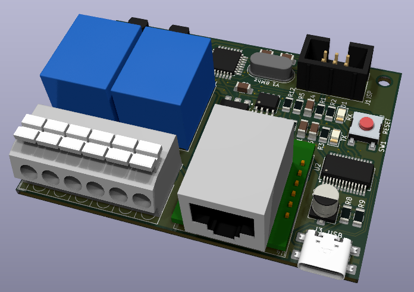

# Ethernet-Relay
Relay module using ethernet and MQTT

Put togethet with parts i had laying around.

Its based on a Atmega328p using minicore Arduino bootloader, running at 8Mhz at 3.3 volts.

Ethernet is a W5500-module brought from aliexpress, a 24LC512 for storing the web-interface, FT232 for communicating via usb and updating FW.

The mqtt topic postfix is "/relay1/set" and "/relay2/set" for turing the relays on or off, and "/relay1" or "/relay2" for getting the current status of the relays, the staus will be published according to update time set in the web-interface.

      

