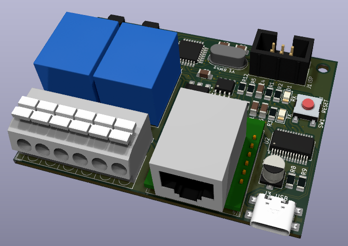
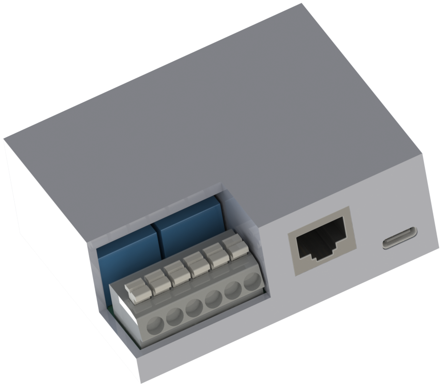
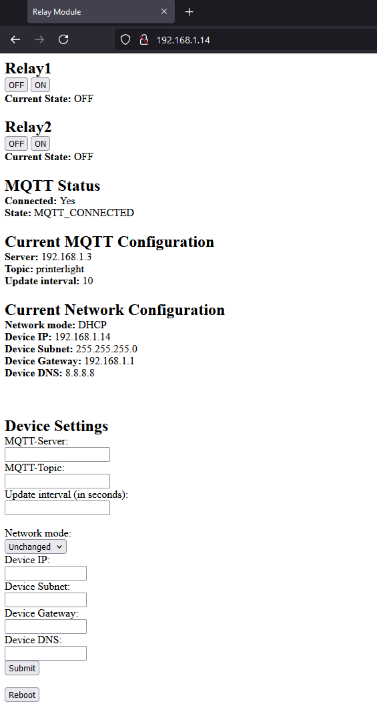
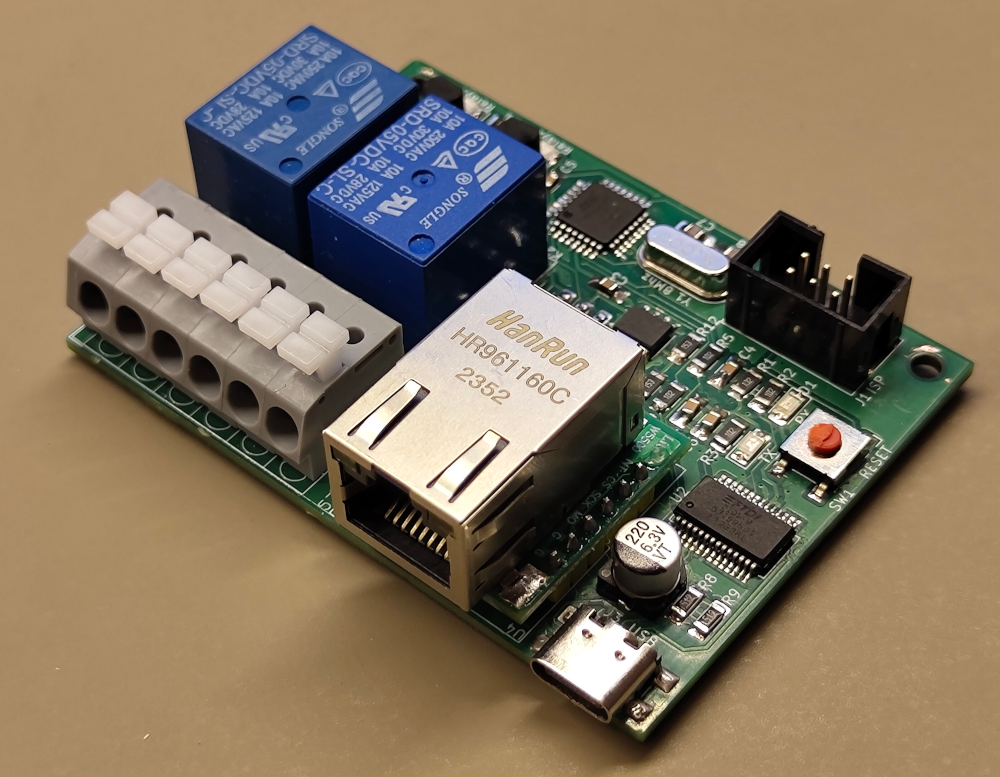
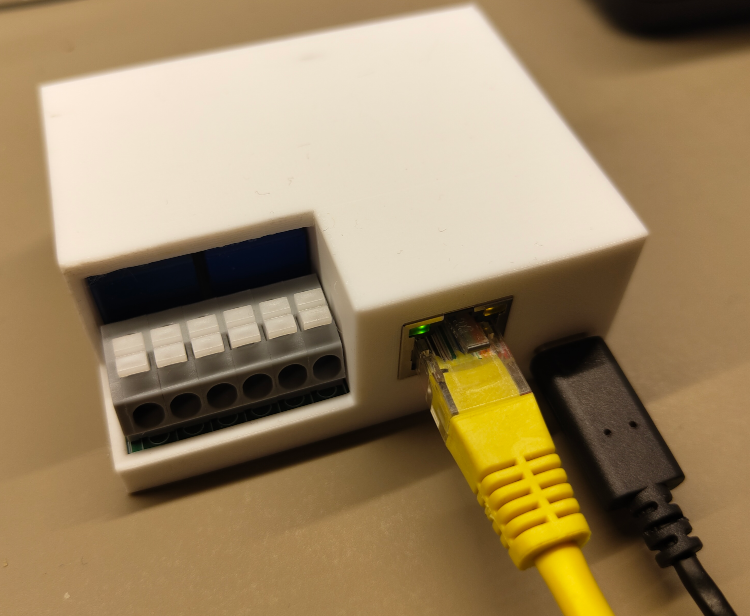
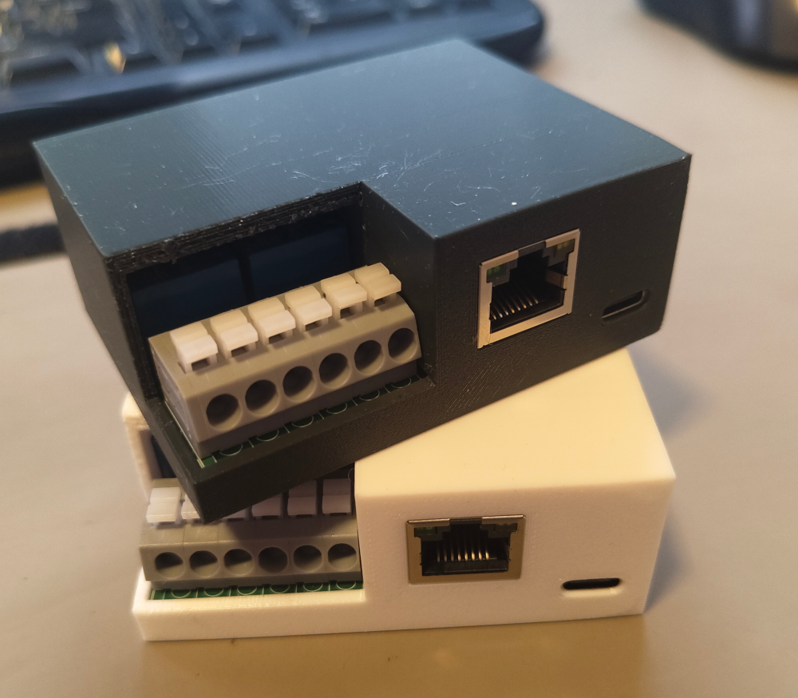

# Ethernet-Relay
Relay module using ethernet and MQTT

Put togethet with parts i had laying around.

Its based on a Atmega328p using minicore Arduino bootloader, running at 8Mhz at 3.3 volts.

Ethernet is a W5500-module brought from aliexpress, a 24LC512 for storing the web-interface, FT232 for communicating via usb and updating FW.

The mqtt topic postfix is "/relay1/set" and "/relay2/set" for turing the relays on or off, and "/relay1" or "/relay2" for getting the current status of the relays, the staus will be published according to update time set in the web-interface.

PCB is drawn in Kicad and the casing is draw using solidworks and printed on a Prusa mini+ 3D-Printer.
The print has inserts melted in place to have threads, used for fasten pcb and the back lid.

Some Instructions, the external EEPROM is written by a seperate program, since the controller is to small to contain the web page while running the primary program. When the EEPROM is written the primary program is uploaded and are using the data on the EEPROM to send the web page to a web-client request.

The FT232 is default set to 100mA, this might not be a problem if the device is powered by a charger, but beeing powered by the USB of a computer 100mA is not enough to power the ethernet or relays, this is solved using FT_PROG to configure the FT232 to be able to draw up to 500mA.

      

      

      

      

      

      

